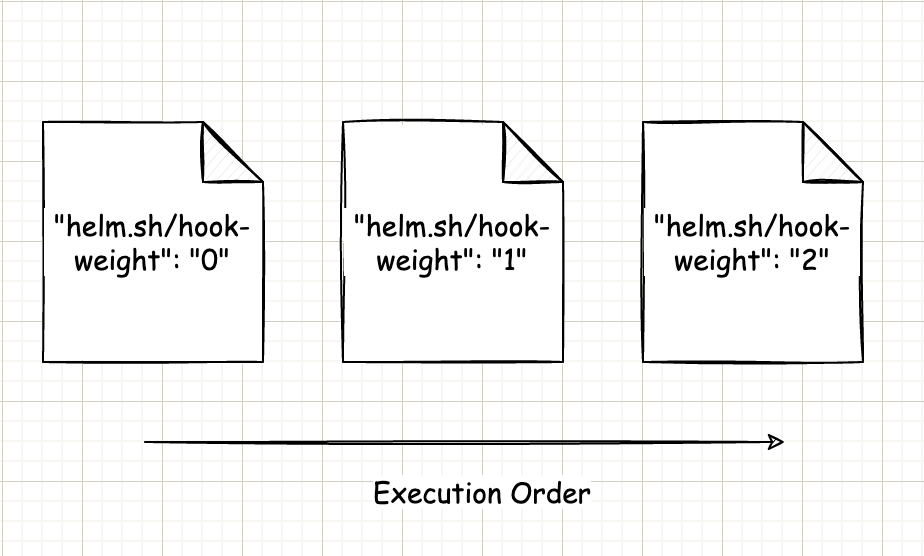

# Example to demonstrate How Helm Chart Hooks works

## What is a Helm Chart Hooks?

1. Using hooks chart developers can either execute logic or create Kubernetes objects at a certain point in the release life cycle.  
2. For e.g., Creating a secret pre-install or Taking a backup of database pre-upgrade.
3. Hooks are like any other template like Pod, Deployment, etc. Helm identifies between a Hook and any other template using `helm.sh/hook` annotation.

## Types of Hooks


## Hooks Deletion Policies


## Hooks Execution Order



## How are Hooks considered to be ready?

1. If hooks are Pods or Jobs, then hooks become ready once Pods or Jobs are completed. 
2. If hooks are any other Kubernetes objects other than Pods and Jobs, then hooks become ready as soon as those objects are loaded or updated.

## Example


### Prerequisite

1. Clone `helm-chart-hooks-example` GitHub repository by running the following command:

   ```
   git clone https://github.com/sagar-jadhav/helm-chart-hooks-example.git
   ```

2. Move to `helm-chart-hooks-example` directory by running the following command:

   ```
   cd ./helm-chart-hooks-example
   ```

3. log in to [Docker Hub](https://hub.docker.com/) by running the following command:

   ```
   docker login -u <Username>
   ```

   Where:
   - `<Username>` is the username to log in to the docker hub.

4. Create the repositories in [Docker Hub](https://hub.docker.com/) with the following names:

   - post-install-db-init
   - post-upgrade-add-data

5. Move to `post-install-init-db` directory by running the following command:

   ```
   cd ./post-install-init-db
   ```

6. Build `post-install` job docker image by running the following command:

    ```
    docker build -t post-install-db-init:1.0.0 .
    ```

7. Tag `post-install` job docker image by running the following command:

    ```
    docker tag post-install-db-init:1.0.0 <Username>/post-install-db-init:1.0.0
    ```

   Where:
   - `<Username>` is the username to log in to the docker hub.

8. Push `post-install` job docker image by running the following command:

   ```
   docker push <Username>/post-install-db-init:1.0.0
   ```

   Where:
   - `<Username>` is the username to log in to the docker hub. 

9. Move out of `post-install-init-db` directory by running the following command:

   ```
   cd ..
   ```

10. Move to `post-upgrade-add-data` by running the following command:

   ```
   cd ./post-upgrade-add-data
   ```

11. Build `post-upgrade` job docker image by running the following command:

     ```
     docker build -t post-upgrade-add-data:1.0.0 .
     ```

12. Tag `post-upgrade` job docker image by running the following command:

     ```
     docker tag post-upgrade-add-data:1.0.0 <Username>/post-upgrade-add-data:1.0.0
     ```

     Where:
     - `<Username>` is the username to log in to the docker hub.

13. Push `post-upgrade` job docker image by running the following command:

      ```
       docker push <Username>/post-upgrade-add-data:1.0.0
       ```

       Where:
       - `<Username>` is the username to log in to the docker hub.

14. Move out of `post-upgrade-add-data` directory by running the following command:

      ```
      cd ..
     ```

15. Provision a single-node Kubernetes cluster.

16. Create the following directories in the Kubernetes node:

      - /root/db-data
      - /root/share
      - /root/scripts

17. Replace `<DockerHub Username>` with the username to log in to the docker hub in `values.yaml` file located at `<Path to helm-chart-hooks-example>/mysql/values.yaml` location.

 ### Demo

 1. Install the `MySQL` application by running the following command:

    ```
    helm install mysql ./mysql/
    ```

    Wait for some time for the command to get executed successfully.

2. Verify that data got populated in the database by running the following command:

   ```
   kubectl exec -it <MySQL Pod Name> -n mysql -- /bin/bash
   ```

   ```
   mysql -hmysql -uroot -padmin
   ```

   ```
   Use Universe;
   ```

   ```
   Select * From Heroes;
   ```

   ```
   exit
   ```

   ```
   exit
   ```

   Where:
   - `<MySQL Pod Name>` is the MySQL Pod name, You can get the MySQL Pod name using the `kubectl get po -n mysql` command.
  
3. Upgrade the MySQL application by running the following command:

   ```
   helm upgrade mysql ./mysql/
   ```

   Wait for some time for the command to get executed successfully.

4. Verify that data got populated in database post upgrade by running the following command:
   
   ```
   kubectl exec -it <MySQL Pod Name> -n mysql -- /bin/bash
   ```

   ```
   mysql -hmysql -uroot -padmin
   ```

   ```
   Use Universe;
   ```

   ```
   Select * From Heroes;
   ```

   ```
   exit
   ```
   
   ```
   exit
   ``` 
   
   Where:
   - `<MySQL Pod Name>` is the MySQL Pod name, You can get the MySQL Pod name using `kubectl get po -n mysql` command.

5. Rollback the MySQL application by running the following command:

   ```
   helm rollback mysql 1
   ```

   Wait for some time for the command to get executed successfully.

6. Verify that data got corrected in the database post rollback by running the following commands:
 
   ```
   kubectl exec -it <MySQL Pod Name> -n mysql -- /bin/bash
   ```

   ```
   mysql -hmysql -uroot -padmin
   ```

   ```
   Use Universe;
   ```

   ```
   Select * From Heroes;
   ```

   ```
   exit
   ```
   
   ```
   exit
   ``` 
   
   Where:
   - `<MySQL Pod Name>` is the MySQL Pod name, You can get the MySQL Pod name using `kubectl get po -n mysql` command.
  
7. Delete the MySQL application by running the following command:

   ```
   helm uninstall mysql
   ```

   Wait for some time for the command to get executed successfully.